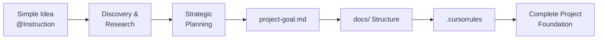

# AI Project Transformation Guide 🤖

> **Transform Simple Ideas into Well-Structured Development Projects**  
> A comprehensive guide for AI agents to systematically convert basic project concepts into professional development projects with proper documentation, goals, and workflows.

## 📋 **Table of Contents**

1. [Overview & Process](#overview--process)
2. [Phase 1: Discovery & Research](#phase-1-discovery--research)
3. [Phase 2: Strategic Planning](#phase-2-strategic-planning)
4. [Phase 3: Documentation Structure](#phase-3-documentation-structure)
5. [Phase 4: Workflow Rules](#phase-4-workflow-rules)
6. [Templates & Examples](#templates--examples)
7. [Context7 Integration](#context7-integration)
8. [Quality Assurance](#quality-assurance)

---

## **Overview & Process**

### **🎯 Transformation Flow**


### **🏗️ Core Deliverables**
- **`project-goal.md`** - Comprehensive project vision and technical planning
- **`docs/` folder** - Organized documentation structure with all necessary files
- **`.cursorrules`** - AI workflow rules and development protocols

### **🎨 Key Principles**
1. **Systematic Approach** - Follow structured phases for consistent results
2. **AI-Friendly** - Clear instructions that AI can follow systematically
3. **Context7 Integration** - Use latest documentation and best practices
4. **Scalable Structure** - Works for projects of any size and complexity
5. **Iterative Enhancement** - Documentation grows with project evolution

---

## **Phase 1: Discovery & Research**

### **🔍 Step 1.1: Analyze Initial Idea**

**Input:** Simple project description (like `@Instruction` file)

**Process:**
1. **Read and Parse** the initial idea document
2. **Extract Core Requirements** from the description
3. **Identify Key Technologies** mentioned or implied
4. **Determine Project Scope** and complexity level

**Example Analysis:**
```yaml
# From @Instruction analysis:
Project_Type: "Family Tree Website"
Technologies: ["Next.js", "Tailwind", "JSON", "TypeScript"]
Main_Functions: 
  - "Add family members"
  - "Add relationships"
  - "Photo management"
  - "Export functionality"
  - "Sharing capabilities"
Scope: "Frontend-only tool for family use"
```

### **🔬 Step 1.2: Context7 Research**

**MANDATORY: Use Context7 for up-to-date information**

```bash
# Research current best practices for identified technologies
use context7 "/vercel/next.js" topic="project structure best practices"
use context7 "/tailwindlabs/tailwindcss" topic="component organization"
use context7 "/microsoft/typescript" topic="project configuration"
```

**Research Questions:**
- What are the latest best practices for the identified technologies?
- What project structures are recommended for this type of application?
- What common patterns and pitfalls should be considered?
- What testing and development workflows are recommended?

### **🎯 Step 1.3: Requirements Gathering**

**Structured Questions to Address:**
1. **Technical Constraints**
   - What technologies must be used or avoided?
   - What are the performance requirements?
   - What deployment environment is expected?

2. **Functional Requirements**
   - What are the core features (MVP)?
   - What are the advanced features (future phases)?
   - Who are the target users?

3. **Project Constraints**
   - What is the timeline?
   - What resources are available?
   - What are the success criteria?

---

## **Phase 2: Strategic Planning**

### **📊 Step 2.1: Create Project Architecture**

**Use this template structure:**

```markdown
## 🏗️ Technical Architecture

### Tech Stack
- **Frontend**: [Framework + Version]
- **Styling**: [CSS Framework]
- **Language**: [TypeScript/JavaScript]
- **Data**: [Storage solution]
- **Authentication**: [If needed]
- **Testing**: [Testing framework]

### Component Structure
```
[Project]/
├── app/
│   ├── components/
│   │   ├── [Feature]/
│   │   └── [Shared]/
│   ├── lib/
│   └── types/
├── data/
├── docs/
└── tests/
```

### Data Flow
[Describe how data moves through the application]
```

### **📋 Step 2.2: Feature Prioritization**

**Use this priority matrix:**
- **P1-CRITICAL**: Must have for MVP (Week 1-2)
- **P2-HIGH**: Important for user experience (Week 3-4)
- **P3-MEDIUM**: Nice to have features (Future sprints)
- **P4-LOW**: Enhancement features (Future phases)

### **🎯 Step 2.3: Success Criteria Definition**

**Template:**
```markdown
## 🎯 Success Criteria

### Functional Requirements
- [ ] **Feature A**: Clear acceptance criteria
- [ ] **Feature B**: Measurable outcomes
- [ ] **Feature C**: User experience goals

### Technical Requirements
- [ ] **Performance**: Specific metrics (load time, response time)
- [ ] **Quality**: Test coverage, code standards
- [ ] **Compatibility**: Browser support, device support

### Business Requirements
- [ ] **User Goals**: What users should achieve
- [ ] **Project Goals**: What the project should deliver
```

---

## **Phase 3: Documentation Structure**

### **📁 Step 3.1: Create docs/ Folder Structure**

**Standard Structure:**
```
docs/
├── README.md                 # Overview and quick start
├── index.md                  # Documentation hub
├── project-overview.md       # Technical architecture
├── task-tracking.md          # Current development tasks
├── completed-tasks.md        # Archive of finished work
├── implementation-notes.md   # Technical details and examples
├── success-criteria.md       # Goals and metrics
├── git-workflow.md          # Development workflow
└── git-quick-reference.md   # Copy-paste commands
```

### **📝 Step 3.2: Generate Each Documentation File**

**Use these templates for each file:**

#### **`docs/index.md` Template:**
```markdown
# [Project Name] Documentation

> **Documentation Index** - Central hub for project documentation

## Overview
[Brief project description with key technologies]

## Documentation Sections

| Document | Description |
|----------|-------------|
| [Project Overview](./project-overview.md) | Project summary, tech stack, architecture |
| [Task Tracking](./task-tracking.md) | Current tasks and status |
| [Completed Tasks](./completed-tasks.md) | Archive of finished tasks |
| [Implementation Notes](./implementation-notes.md) | Technical details and code examples |
| [Git Workflow](./git-workflow.md) | Mandatory development procedures |
| [Success Criteria](./success-criteria.md) | Project goals and metrics |

## Project Status
- **Current Phase**: [Phase name]
- **Progress**: [X% complete]
- **Next Task**: [Next task description]
- **Development Process**: [TDD/Agile/etc.]

## Key Commands
[Include development commands]

## Context7 Integration
| Technology | Context7 ID | Use Case |
|------------|-------------|----------|
| [Tech] | `/org/project` | [Purpose] |
```

#### **`docs/task-tracking.md` Template:**
```markdown
# Task Tracking

> **Current Development Tasks** - Active task management and status tracking

## Current Sprint

### Phase [X]: [Phase Name]
**Timeline**: [Start] - [End]  
**Goal**: [Phase objective]

| Task ID | Title | Status | Priority | Agent | Dependencies |
|---------|-------|--------|----------|-------|--------------|
| [X.1] | [Task] | [Status] | [P1-P4] | [Agent] | [Deps] |

## Task Details

### Task [X.1] - [Title]
**Status**: [Pending/In Progress/Completed/Blocked]  
**Priority**: [P1-CRITICAL to P4-LOW]  
**Assigned**: [Agent/Developer]  
**Dependencies**: [Task IDs that must be completed first]

**Description**:
[Detailed task description]

**Acceptance Criteria**:
- [ ] [Specific requirement 1]
- [ ] [Specific requirement 2]

**Implementation Notes**:
[Technical details, approaches, considerations]
```

#### **`docs/project-overview.md` Template:**
```markdown
# Project Overview

> **Project Architecture** - Technical foundation and implementation strategy

## 🎯 Project Summary
[Comprehensive project description]

### Core Requirements
- **[Feature A]**: [Description]
- **[Feature B]**: [Description]

## 🏗️ Technical Architecture

### Current State Analysis
**✅ Existing Foundation:**
[List what's already implemented]

**🎯 Target Features:**
[List features to implement]

### Component Structure
```
[Show file/folder organization]
```

### Data Structure
```json
{
  "example": "data structure"
}
```

## 🚀 Development Phases

### Phase 1: [Name] (Priority: CRITICAL | Week 1)
**Goal**: [Phase objective]
**Tasks**:
1. **P1-CRITICAL** [Task description]
2. **P2-HIGH** [Task description]

**Definition of Done**:
- [ ] [Specific requirement]
```

### **🔗 Step 3.3: Cross-Reference Integration**

**Ensure all documents link to each other:**
- Use `@filename` references for AI reading
- Include navigation between documents
- Maintain consistent terminology
- Update all affected documents when changes occur

---

## **Phase 4: Workflow Rules**

### **⚙️ Step 4.1: Create .cursorrules File**

**Template Structure:**
```markdown
- Always use [OS-specific command] for [Platform]
- When chat, try to save tokens as much as possible
- If code relates to [Technology], read file .cursor\rules\rule-[technology]
- Use the best AI suitable for the task

## 🤖 AI Task Workflow Rules

### MANDATORY Task Reading Protocol
- **BEFORE any development work**: When given a task ID, you MUST:
  1. Read @project-goal.md to understand the project
  2. Read specific task details from @docs/task-tracking.md
  3. Verify task dependencies and prerequisites
  4. Only proceed after confirming understanding

### MANDATORY Testing Protocol
- **BEFORE starting development**:
  1. Run existing tests: `[test command]`
  2. Write unit tests following TDD principles
  3. Verify tests fail appropriately (red phase)
- **DURING development**:
  1. Implement minimum code to pass tests (green phase)
  2. Refactor while keeping tests passing
  3. Run tests frequently for regression checking
- **AFTER implementation**:
  1. Run all tests to ensure no regressions
  2. Add edge case tests if necessary
  3. Document test coverage

### MANDATORY Task Update Protocol
- **AFTER completing any task**: You MUST:
  1. Update task status in @docs/task-tracking.md
  2. Move completed tasks to @docs/completed-tasks.md
  3. Document issues and deviations
  4. Update dependent tasks if applicable

### Context7 Integration
- For technical implementations, use Context7 for up-to-date docs
- Reference Context7 library IDs: [/org/project]
- Include Context7 queries in technical prompts

### Task Status Values
- **Pending**: Not yet started
- **In Progress**: Currently being worked on
- **Completed**: Finished successfully
- **Blocked**: Unable to proceed
- **Error**: Failed with issues

### Documentation Structure
- **Project Documentation**: Located in @docs/ directory
  - index.md - Main documentation hub
  - project-overview.md - Technical architecture
  - task-tracking.md - Current tasks
  - completed-tasks.md - Finished tasks archive
  - implementation-notes.md - Technical details
  - success-criteria.md - Goals and metrics
```

### **📋 Step 4.2: Technology-Specific Rules**

**Create additional rule files for specific technologies:**

```
.cursor/rules/
├── rule-nextjs.md          # Next.js specific patterns
├── rule-typescript.md      # TypeScript conventions
├── rule-tailwind.md        # Tailwind CSS standards
└── rule-testing.md         # Testing procedures
```

---

## **Templates & Examples**

### **🎯 project-goal.md Template**

```markdown
# [Project Name] - Project Goals

## 🤖 **AI Summary**
**[One-line project transformation description]**

**Core Tech**: [Tech stack]  
**Key Features**: [Main features]  
**Architecture**: [Architecture approach]  
**Priority**: [Development order]

---

## 🎯 **Project Vision**
[Comprehensive project description and goals]

---

## 📋 **Core Objectives**

### **Primary Goal**
[Main project objective]

### **Secondary Goals**
[Supporting objectives]

---

## 🏗️ **Technical Architecture**

### **Tech Stack**
```
[Detailed technology choices with versions]
```

### **File Structure & Naming Conventions**
```
[Complete project structure]
```

---

## 📊 **Data Structure**
```json
{
  "example": "data structure"
}
```

---

## 🔐 **Authentication & Access Control**
[If applicable]

---

## 🎨 **UI/UX Goals**
[Design and user experience requirements]

---

## 🚀 **Development Phases**

### **Phase 1: [Name]** (Priority: CRITICAL | Week 1)
**Goal**: [Phase objective]
**Tasks**:
1. **P1-CRITICAL** [Task]
2. **P2-HIGH** [Task]

**Definition of Done**:
- [ ] [Requirement]

---

## 🔧 **Feature Requirements**

### **📋 PLANNED Features**
- [ ] **P1-CRITICAL** [Feature]
- [ ] **P2-HIGH** [Feature]

### **✅ COMPLETED Features**
- [x] [Completed feature]

---

## 🎯 **Success Criteria**
[Measurable outcomes and acceptance criteria]

---

## 📈 **Future Enhancements**
[Future development phases]

---

## 📋 **Project Deliverables**
[Expected outputs and artifacts]
```

### **📝 Example Transformation**

**Input (`@Instruction`):**
```
Title: Family tree website.
- Create a simple UI, using Next.js, Tailwind
- Beautiful UI, admin can input, edit family tree
- Well-written document and md, prd file
```

**Output Structure:**
1. **`project-goal.md`** - 500+ lines comprehensive planning
2. **`docs/` folder** - 8+ documentation files
3. **`.cursorrules`** - AI workflow rules

---

## **Context7 Integration**

### **🔍 Research Phase Requirements**

**For every project transformation, use Context7 to research:**

```bash
# Project planning and architecture
use context7 "/sdi2200262/agentic-project-management" topic="project planning structure"
use context7 "/10up/engineering-best-practices" topic="project organization"

# Technology-specific research
use context7 "/vercel/next.js" topic="[specific feature]"
use context7 "/tailwindlabs/tailwindcss" topic="[specific need]"
use context7 "/microsoft/typescript" topic="[specific implementation]"

# Testing and quality
use context7 "/testing-library/react-testing-library" topic="testing patterns"
```

### **📚 Context7 Documentation Table**

**Include this in every project-goal.md:**

```markdown
## Context7 Integration

| Technology | Context7 ID | Use Case |
|------------|-------------|----------|
| [Framework] | `/org/project` | [Primary usage] |
| [Library] | `/org/library` | [Specific feature] |
| [Tool] | `/org/tool` | [Development workflow] |
```

### **🤖 AI Context7 Protocol**

**For AI agents working on projects:**

1. **BEFORE implementing any feature**: Research current best practices
2. **DURING development**: Reference Context7 for specific implementation details
3. **AFTER completion**: Validate against latest recommendations

---

## **Quality Assurance**

### **✅ Transformation Checklist**

**Phase 1: Discovery & Research**
- [ ] Initial idea thoroughly analyzed
- [ ] Context7 research completed for all technologies
- [ ] Requirements clearly defined
- [ ] Technical constraints identified

**Phase 2: Strategic Planning**
- [ ] Technical architecture defined
- [ ] Features prioritized (P1-P4)
- [ ] Success criteria established
- [ ] Development phases planned

**Phase 3: Documentation Structure**
- [ ] All required docs/ files created
- [ ] Cross-references properly linked
- [ ] Templates properly populated
- [ ] Consistent terminology used

**Phase 4: Workflow Rules**
- [ ] .cursorrules file comprehensive
- [ ] Technology-specific rules included
- [ ] AI workflow protocols defined
- [ ] Context7 integration specified

### **📊 Quality Metrics**

**Documentation Completeness:**
- `project-goal.md`: 500+ lines, comprehensive planning
- `docs/` folder: 8+ essential files
- `.cursorrules`: Complete AI workflow rules

**Technical Coverage:**
- Architecture clearly defined
- Technology choices justified
- Development workflow specified
- Testing strategy included

**AI Usability:**
- Clear step-by-step instructions
- Consistent file references (@filename)
- Context7 integration points
- Actionable task definitions

---

## **🚀 Getting Started**

### **For AI Agents**

1. **Read this guide completely**
2. **Analyze the input idea/instruction file**
3. **Follow phases 1-4 systematically**
4. **Use Context7 extensively for research**
5. **Generate all required deliverables**
6. **Validate using the QA checklist**

### **For Human Developers**

1. **Provide clear initial project idea**
2. **Review AI-generated project-goal.md**
3. **Validate technical architecture decisions**
4. **Approve documentation structure**
5. **Begin development using established workflows**

---

**🎯 Expected Outcome**: A simple project idea transformed into a professional development project with comprehensive planning, organized documentation, and AI-friendly workflows that can scale from MVP to enterprise-level applications.

**📝 Note**: This guide is designed to be followed systematically by AI agents to ensure consistent, high-quality project transformations regardless of project size or complexity.

---

*Guide Version: 1.0 - Optimized for AI agents using Context7 integration*