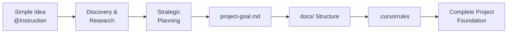

# AI Project Transformation Guide 🤖

> **Transform Simple Ideas into Well-Structured Development Projects**  
> A comprehensive guide for AI agents to systematically convert basic project concepts into professional development projects with proper documentation, goals, and workflows.
>
> **🎯 Based on Real Implementation**: This guide is refined using proven patterns from the Family Tree Design Tool project - a successful transformation from simple idea to professional design application with canvas-based editing, CRUD operations, and comprehensive documentation.

## 📋 **Table of Contents**

1. [Overview & Process](#overview--process)
2. [Phase 1: Discovery & Research](#phase-1-discovery--research)
3. [Phase 2: Strategic Planning](#phase-2-strategic-planning)
4. [Phase 3: Documentation Structure](#phase-3-documentation-structure)
5. [Phase 4: Workflow Rules](#phase-4-workflow-rules)
6. [Templates & Examples](#templates--examples)
7. [Context7 Integration](#context7-integration)
8. [Quality Assurance](#quality-assurance)

---

## **Overview & Process**

### **🎯 Transformation Flow**


### **🏗️ Core Deliverables** (Enhanced Structure)
- **`PROJECT-OVERVIEW.md`** - Master consolidated project vision (2000+ lines comprehensive planning)
- **`UNIFIED-TASK-TRACKING.md`** - Single source of truth for all development tasks (original + improvement)
- **`IMPROVEMENT-TASK-TRACKING.md`** - Detailed improvement epic tracking with agent assignments
- **`CLAUDE.md`** - AI workflow rules and development protocols
- **`docs/` folder** - Organized technical documentation structure with implementation details
- **`.cursorrules`** - Basic AI workflow rules (enhanced version in CLAUDE.md)

### **🎨 Key Principles** (Proven Implementation Patterns)
1. **Systematic Approach** - Follow structured phases for consistent results
2. **AI-Friendly** - Clear instructions that AI can follow systematically with @filename references
3. **Context7 Integration** - Use latest documentation and best practices for all technical decisions
4. **Scalable Structure** - Works for projects of any size and complexity (tested with canvas-based design tools)
5. **Iterative Enhancement** - Documentation grows with project evolution through improvement epics
6. **Dual Task Management** - Separate original development phases from improvement plan epics
7. **Agent Workflow Integration** - Support for specialized AI agents (@pm, @po, @sm, @dev, @qa, @architect, @ux-expert)
8. **Consolidated Documentation** - Master documents with cross-reference navigation for AI optimization

---

## **Phase 1: Discovery & Research**

### **🔍 Step 1.1: Analyze Initial Idea**

**Input:** Simple project description (like `@Instruction` file)

**Process:**
1. **Read and Parse** the initial idea document
2. **Extract Core Requirements** from the description
3. **Identify Key Technologies** mentioned or implied
4. **Determine Project Scope** and complexity level

**Example Analysis** (Real Implementation):
```yaml
# From Family Tree Design Tool transformation:
Project_Type: "Canvas-Based Family Tree Design Tool"
Technologies: 
  - "Next.js 15.4.5 (App Router + Turbopack)"
  - "TypeScript 5 (Full type safety)"
  - "Tailwind CSS 4 (Utility-first responsive design)"
  - "React DnD 16.0.1 (Canvas interactions)"
  - "JWT Authentication with bcryptjs"
Main_Functions: 
  - "Interactive canvas with drag-and-drop positioning"
  - "Enhanced member banners with relationship labels"
  - "CRUD operations with comprehensive modals"
  - "Share link generation with secure URLs"
  - "Export functionality (CSV data, PNG images)"
  - "Mobile-optimized touch interface"
Scope: "Professional design tool similar to Canva for families"
Architecture_Evolution: "Simple viewer → Canvas-based design tool"
```

### **🔬 Step 1.2: Context7 Research**

**MANDATORY: Use Context7 for up-to-date information**

```bash
# Research current best practices for identified technologies (Proven Pattern)
use context7 "/vercel/next.js" topic="App Router patterns, API routes, middleware"
use context7 "/tailwindlabs/tailwindcss" topic="component styling, responsive design"
use context7 "/microsoft/typescript" topic="interface design, strict mode configuration"
use context7 "/react-dnd/react-dnd" topic="canvas drag-and-drop implementation"
use context7 "/niklasvh/html2canvas" topic="image export functionality"
use context7 "/auth0/node-jsonwebtoken" topic="authentication and security"
use context7 "/testing-library/react-testing-library" topic="component testing patterns"
```

**Research Questions:**
- What are the latest best practices for the identified technologies?
- What project structures are recommended for this type of application?
- What common patterns and pitfalls should be considered?
- What testing and development workflows are recommended?

### **🎯 Step 1.3: Requirements Gathering**

**Structured Questions to Address:**
1. **Technical Constraints**
   - What technologies must be used or avoided?
   - What are the performance requirements?
   - What deployment environment is expected?

2. **Functional Requirements**
   - What are the core features (MVP)?
   - What are the advanced features (future phases)?
   - Who are the target users?

3. **Project Constraints**
   - What is the timeline?
   - What resources are available?
   - What are the success criteria?

---

## **Phase 2: Strategic Planning**

### **📊 Step 2.1: Create Project Architecture**

**Use this template structure:**

```markdown
## 🏗️ Technical Architecture

### Tech Stack
- **Frontend**: [Framework + Version]
- **Styling**: [CSS Framework]
- **Language**: [TypeScript/JavaScript]
- **Data**: [Storage solution]
- **Authentication**: [If needed]
- **Testing**: [Testing framework]

### Component Structure
```
[Project]/
├── app/
│   ├── components/
│   │   ├── [Feature]/
│   │   └── [Shared]/
│   ├── lib/
│   └── types/
├── data/
├── docs/
└── tests/
```

### Data Flow
[Describe how data moves through the application]
```

### **📋 Step 2.2: Feature Prioritization**

**Use this priority matrix:**
- **P1-CRITICAL**: Must have for MVP (Week 1-2)
- **P2-HIGH**: Important for user experience (Week 3-4)
- **P3-MEDIUM**: Nice to have features (Future sprints)
- **P4-LOW**: Enhancement features (Future phases)

### **🎯 Step 2.3: Success Criteria Definition**

**Template:**
```markdown
## 🎯 Success Criteria

### Functional Requirements
- [ ] **Feature A**: Clear acceptance criteria
- [ ] **Feature B**: Measurable outcomes
- [ ] **Feature C**: User experience goals

### Technical Requirements
- [ ] **Performance**: Specific metrics (load time, response time)
- [ ] **Quality**: Test coverage, code standards
- [ ] **Compatibility**: Browser support, device support

### Business Requirements
- [ ] **User Goals**: What users should achieve
- [ ] **Project Goals**: What the project should deliver
```

---

## **Phase 3: Documentation Structure**

### **📁 Step 3.1: Create docs/ Folder Structure**

**Enhanced Structure** (Proven Implementation):
```
# Master Documentation (Root Level)
PROJECT-OVERVIEW.md           # Master consolidated document (2000+ lines)
UNIFIED-TASK-TRACKING.md      # Single source for all tasks (original + improvement)
IMPROVEMENT-TASK-TRACKING.md  # Detailed improvement epic tracking
CLAUDE.md                     # AI workflow rules and development protocols

# Technical Documentation (docs/ folder)
docs/
├── index.md                  # Documentation hub with navigation
├── project-overview.md       # Technical architecture (legacy, now consolidated)
├── task-tracking.md          # Original development tasks (historical reference)
├── completed-tasks.md        # Archive of finished work with implementation notes
├── implementation-notes.md   # Technical details and code examples
├── success-criteria.md       # Goals and metrics
├── git-workflow.md          # Development procedures and standards
└── git-quick-reference.md   # Copy-paste commands

# AI Context Files (memory-bank/ folder)
memory-bank/
├── activeContext.md          # Current project state for AI agents
├── systemPatterns.md         # Technical patterns and conventions
├── productContext.md         # Product requirements and user personas
└── progress.md               # Development progress tracking
```

### **📝 Step 3.2: Generate Each Documentation File**

**Use these enhanced templates based on successful implementation:**

#### **`PROJECT-OVERVIEW.md` Template** (Master Document):
```markdown
# [Project Name] - Project Overview

> **Consolidated Project Documentation** - Master reference for project vision, architecture, and implementation strategy

## 🤖 **AI Summary**
[One-line project transformation description]

**Core Stack**: [Tech stack with versions]  
**Key Features**: [Main features]  
**Architecture**: [Architecture approach]  
**Development Priority**: [Phase order]

---

## 📋 **Project Vision & Objectives**

### **Primary Mission**
[Transform description with specific goals]

### **Target Users & Personas**
[Detailed user personas with age, tech level, goals, needs]

---

## 🏗️ **Technical Architecture**

### **Technology Stack**
```yaml
# Core Framework
Frontend: [Framework + Version]
Language: [TypeScript/JavaScript + Version]
Styling: [CSS Framework + Version]

# Specialized Libraries
[Feature]: [Library + Version] ([Purpose])
[Authentication]: [Solution] ([Security approach])

# Development & Testing
Build Tool: [Tool] ([Features])
Testing: [Framework] ([Coverage approach])
Type Checking: [TypeScript configuration]
```

### **Enhanced Data Models**
```typescript
// Core interfaces with canvas-ready fields
interface [MainEntity] {
  // Identity & Basic Info
  id: string;
  name: string;
  // ... other fields
  
  // Canvas Design Tool Fields (NEW)
  position: { x: number; y: number };
  size: { width: number; height: number };
  [designField]: string;
}
```

### **Component Architecture**
```
[project]/app/
├── components/
│   ├── [Feature]/           # Interactive [Feature] System
│   ├── [UI]/               # Professional Design Tool Interface
│   ├── [Management]/       # CRUD & Management Interfaces
│   └── [Export]/           # Export & Sharing System
├── contexts/               # Global State Management
├── lib/                    # Utilities & Business Logic
└── api/                    # Next.js API Routes
```

---

## 📊 **Current Implementation Status**

### **✅ Completed Foundation (Phase 1-2)**
[List major achievements with technical details]

### **⏳ Planned Features (Phase 3-4)**  
[List upcoming features with priorities]

---

## 🚀 **Development Phases & Implementation Strategy**

### **Phase 1: [Name]** ✅ **COMPLETED**
**Timeline**: Week 1 | **Priority**: CRITICAL  
**Goal**: [Phase objective]
**Key Achievements**: [Specific accomplishments]

### **Phase 2: [Name]** ✅ **COMPLETED**
**Timeline**: Week 2 | **Priority**: CRITICAL  
**Goal**: [Phase objective]
**Key Achievements**: [Specific accomplishments]

### **Phase 3: [Name]** 🔄 **IN PROGRESS**
**Timeline**: Week 3 | **Priority**: HIGH  
**Goal**: [Phase objective]
**Current Tasks**: [Active work items]

---

## 🎯 **Success Criteria & Quality Standards**

### **Functional Requirements**
- **✅ [Feature A]**: [Specific implementation achieved]
- **⏳ [Feature B]**: [Planned functionality]

### **Performance Standards**
- **✅ [Metric A]**: [Achieved performance with specific numbers]
- **✅ [Metric B]**: [Measured results]

### **Technical Quality**
- **✅ TypeScript**: Strict mode with comprehensive type safety
- **✅ Testing**: [Framework] with [Coverage] coverage
- **✅ Accessibility**: WCAG 2.1 AA compliance

---

## 📚 **Documentation & Context Integration**

### **AI-Optimized Documentation Structure**
[Show complete documentation tree]

### **Context7 Integration References**
| Technology | Context7 ID | Primary Use Case |
|------------|-------------|------------------|
| [Tech A] | `/org/project` | [Specific usage] |
| [Tech B] | `/org/library` | [Feature implementation] |

### **Cross-Reference Navigation**
**Quick Access Links:**
- **Task Management**: @UNIFIED-TASK-TRACKING.md for current status
- **Development Rules**: @CLAUDE.md for AI workflow protocols
- **Technical Details**: @docs/implementation-notes.md for code examples

---

## 🔮 **Future Enhancements & Roadmap**
[Planned future phases with specific features]

---

*📝 **Document Status**: Master consolidated documentation*  
*🔄 **Last Updated**: [Date] | [Current Epic]*  
*🤖 **AI-Optimized**: Structured for agent workflows with Context7 integration*
```

#### **`docs/index.md` Template:**
```markdown
# [Project Name] Documentation

> **Documentation Index** - Central hub for project documentation

## Overview
[Brief project description with key technologies]

## Documentation Sections

| Document | Description |
|----------|-------------|
| [Project Overview](./project-overview.md) | Project summary, tech stack, architecture |
| [Task Tracking](./task-tracking.md) | Current tasks and status |
| [Completed Tasks](./completed-tasks.md) | Archive of finished tasks |
| [Implementation Notes](./implementation-notes.md) | Technical details and code examples |
| [Git Workflow](./git-workflow.md) | Mandatory development procedures |
| [Success Criteria](./success-criteria.md) | Project goals and metrics |

## Project Status
- **Current Phase**: [Phase name]
- **Progress**: [X% complete]
- **Next Task**: [Next task description]
- **Development Process**: [TDD/Agile/etc.]

## Key Commands
[Include development commands]

## Context7 Integration
| Technology | Context7 ID | Use Case |
|------------|-------------|----------|
| [Tech] | `/org/project` | [Purpose] |
```

#### **`docs/task-tracking.md` Template:**
```markdown
# Task Tracking

> **Current Development Tasks** - Active task management and status tracking

## Current Sprint

### Phase [X]: [Phase Name]
**Timeline**: [Start] - [End]  
**Goal**: [Phase objective]

| Task ID | Title | Status | Priority | Agent | Dependencies |
|---------|-------|--------|----------|-------|--------------|
| [X.1] | [Task] | [Status] | [P1-P4] | [Agent] | [Deps] |

## Task Details

### Task [X.1] - [Title]
**Status**: [Pending/In Progress/Completed/Blocked]  
**Priority**: [P1-CRITICAL to P4-LOW]  
**Assigned**: [Agent/Developer]  
**Dependencies**: [Task IDs that must be completed first]

**Description**:
[Detailed task description]

**Acceptance Criteria**:
- [ ] [Specific requirement 1]
- [ ] [Specific requirement 2]

**Implementation Notes**:
[Technical details, approaches, considerations]
```

#### **`docs/project-overview.md` Template:**
```markdown
# Project Overview

> **Project Architecture** - Technical foundation and implementation strategy

## 🎯 Project Summary
[Comprehensive project description]

### Core Requirements
- **[Feature A]**: [Description]
- **[Feature B]**: [Description]

## 🏗️ Technical Architecture

### Current State Analysis
**✅ Existing Foundation:**
[List what's already implemented]

**🎯 Target Features:**
[List features to implement]

### Component Structure
```
[Show file/folder organization]
```

### Data Structure
```json
{
  "example": "data structure"
}
```

## 🚀 Development Phases

### Phase 1: [Name] (Priority: CRITICAL | Week 1)
**Goal**: [Phase objective]
**Tasks**:
1. **P1-CRITICAL** [Task description]
2. **P2-HIGH** [Task description]

**Definition of Done**:
- [ ] [Specific requirement]
```

### **🔗 Step 3.3: Cross-Reference Integration**

**Ensure all documents link to each other:**
- Use `@filename` references for AI reading
- Include navigation between documents
- Maintain consistent terminology
- Update all affected documents when changes occur

---

## **Phase 4: Workflow Rules**

### **⚙️ Step 4.1: Create .cursorrules File**

**Enhanced CLAUDE.md Structure** (Proven Implementation):
```markdown
# CLAUDE.md

This file provides guidance to Claude Code (claude.ai/code) when working with code in this repository.

## AI Task Workflow

### 1. Project Understanding (Mandatory - Enhanced Documentation)
Before starting any task, you MUST read and understand the following documents to grasp the project's goals, scope, and current state.

**📋 Master Documents (Start Here)**:
- **Project Overview**: PROJECT-OVERVIEW.md (consolidated project vision, architecture, and status)
- **Task Management**: UNIFIED-TASK-TRACKING.md (integrated task tracking for all development phases)
- **Documentation Hub**: [project]/docs/index.md (AI-optimized navigation and quick start)

**🔧 Supporting References**:
- **Success Criteria**: [project]/docs/success-criteria.md (quality standards and acceptance criteria)
- **Implementation Archive**: [project]/docs/completed-tasks.md (historical patterns and examples)

### 2. Task-Specific Instructions (Enhanced for Multi-Phase Development)
For any given task ID (e.g., "Task 3.1", "E2-T3"), you MUST:

**For Original Development Tasks (Task X.Y format)**:
1. Read UNIFIED-TASK-TRACKING.md section "Original Development Phases"
2. Check the specific phase (1-4) for task details and dependencies
3. Review [project]/docs/completed-tasks.md for related implementation patterns

**For Improvement Plan Tasks (EX-TY format)**:
1. Read UNIFIED-TASK-TRACKING.md section "Improvement Plan Epics"  
2. Check the specific epic (E1-E4) for task details and agent assignments
3. Review IMPROVEMENT-TASK-TRACKING.md for detailed acceptance criteria

**For Both Task Types**:
4. Understand task description, status, dependencies, and acceptance criteria
5. Check agent assignments and role-specific requirements
6. Verify prerequisites are met before proceeding
7. Only proceed with implementation after confirming complete understanding

## Task Detail Location Guide

**Before starting any task, follow this lookup flow:**

1. **Task Assignment**: "Do Task 2.2 (P1-CRITICAL): [Task Description]"
2. **Quick Status Check**: Read UNIFIED-TASK-TRACKING.md for current status
3. **Get Full Details**:
   - **Original Tasks (Task X.Y)**: Read [project]/docs/task-tracking.md
   - **Improvement Tasks (EX-TY)**: Read IMPROVEMENT-TASK-TRACKING.md
4. **Proceed**: Only start implementation after reading full acceptance criteria

### 3. Task Status Updates (MANDATORY - DO NOT SKIP)
**CRITICAL**: You MUST complete ALL steps below in EXACT ORDER. Do NOT proceed to git operations without completing documentation updates first.

**Required Steps (Must Complete in Order):**
- [ ] **Step 1 - Complete Code Implementation**: Finish writing all code changes for the task.
- [ ] **Step 2 - Update Documentation (MANDATORY BEFORE GIT)**: After code is complete but BEFORE any git operations, you MUST update the following:
  - [ ] Update the task's status in `[project]/docs/task-tracking.md`
  - [ ] Move the completed task details to `[project]/docs/completed-tasks.md`, including any implementation notes
  - [ ] Document any issues encountered or deviations from the original plan
  - [ ] Update documentation with your latest achievements
- [ ] **Step 3 - Perform Git Operations**: ONLY after ALL documentation is updated, proceed with git commits and pushes.

**WARNING**: Skipping Step 2 documentation updates is a critical workflow violation. Always verify documentation is updated before any git commit.

## Working Directory

The main application code is located in the `[project]/` subdirectory. Always work from the application directory when running commands or editing application files.

## Development Workflow

### Git Workflow (Mandatory)
1. **Create a Branch**: Before writing any code, create a feature branch.
   - **Format**: `task{ID}-{kebab-case-description}`
   - **Example**: `task1-1-setup-nextjs-project`
2. **Commit Changes**: Write clear and concise commit messages.
   - **Format**: `type(scope): description`
   - **Example**: `feat(auth): implement jwt token generation`
3. **Create a Pull Request**: After pushing your changes, create a PR. The description should include task details.

## Development Commands & Architecture

For development commands, tech stack details, and architecture overview, refer to:
- **Development Commands**: See `[project]/README.md` - Getting Started section
- **Architecture Overview**: See `[project]/docs/project-overview.md` - comprehensive tech stack and structure
- **Project Goals**: See `PROJECT-OVERVIEW.md` - detailed technical architecture and data models

## Task Status Values
- `Pending`: Not yet started
- `In Progress`: Currently being worked on
- `Completed`: Finished successfully
- `Blocked`: Unable to proceed
- `Error`: Task failed and needs resolution

## Documentation Structure
- **Project Documentation**: [project]/docs/
  - index.md: Main documentation hub
  - project-overview.md: Project summary, tech stack, and architecture
  - task-tracking.md: Current tasks and their status
  - completed-tasks.md: Archive of finished tasks with implementation notes
  - implementation-notes.md: Technical implementation details
  - success-criteria.md: Project goals and metrics for success
- **Documentation Archive**: Previous project notes and reference materials

## Task Reference Format
- **Git Branch Name Format**: `task{ID}-{kebab-case-description}`
  - *Example*: `task1-1-setup-nextjs-project`
- **Task Reference Format**: "Task [ID] - [Title]"
  - *Example*: "Task 1.1 - Setup Next.js Project"
```

### **📋 Step 4.2: Technology-Specific Rules**

**Create additional rule files for specific technologies:**

```
.cursor/rules/
├── rule-nextjs.md          # Next.js specific patterns
├── rule-typescript.md      # TypeScript conventions
├── rule-tailwind.md        # Tailwind CSS standards
└── rule-testing.md         # Testing procedures
```

---

## **Templates & Examples**

### **🎯 project-goal.md Template**

```markdown
# [Project Name] - Project Goals

## 🤖 **AI Summary**
**[One-line project transformation description]**

**Core Tech**: [Tech stack]  
**Key Features**: [Main features]  
**Architecture**: [Architecture approach]  
**Priority**: [Development order]

---

## 🎯 **Project Vision**
[Comprehensive project description and goals]

---

## 📋 **Core Objectives**

### **Primary Goal**
[Main project objective]

### **Secondary Goals**
[Supporting objectives]

---

## 🏗️ **Technical Architecture**

### **Tech Stack**
```
[Detailed technology choices with versions]
```

### **File Structure & Naming Conventions**
```
[Complete project structure]
```

---

## 📊 **Data Structure**
```json
{
  "example": "data structure"
}
```

---

## 🔐 **Authentication & Access Control**
[If applicable]

---

## 🎨 **UI/UX Goals**
[Design and user experience requirements]

---

## 🚀 **Development Phases**

### **Phase 1: [Name]** (Priority: CRITICAL | Week 1)
**Goal**: [Phase objective]
**Tasks**:
1. **P1-CRITICAL** [Task]
2. **P2-HIGH** [Task]

**Definition of Done**:
- [ ] [Requirement]

---

## 🔧 **Feature Requirements**

### **📋 PLANNED Features**
- [ ] **P1-CRITICAL** [Feature]
- [ ] **P2-HIGH** [Feature]

### **✅ COMPLETED Features**
- [x] [Completed feature]

---

## 🎯 **Success Criteria**
[Measurable outcomes and acceptance criteria]

---

## 📈 **Future Enhancements**
[Future development phases]

---

## 📋 **Project Deliverables**
[Expected outputs and artifacts]
```

### **📝 Real Transformation Example** (Proven Success)

**Input (`@Instruction`):**
```
Title: Family tree website.
- Create a simple UI, using Next.js, Tailwind
- Beautiful UI, admin can input, edit family tree
- Well-written document and md, prd file
```

**Actual Output Structure** (Family Tree Design Tool):
1. **`PROJECT-OVERVIEW.md`** - 2000+ lines master consolidated document
2. **`UNIFIED-TASK-TRACKING.md`** - Single source for all development tasks (original + improvement)
3. **`IMPROVEMENT-TASK-TRACKING.md`** - Detailed improvement epic tracking with agent workflows
4. **`CLAUDE.md`** - Enhanced AI workflow rules and development protocols  
5. **`docs/` folder** - 8+ technical documentation files with implementation details
6. **`memory-bank/` folder** - AI context files for agent optimization
7. **`.cursorrules`** - Basic AI workflow rules

**Transformation Results:**
- **Project Scope Evolution**: Simple viewer → Professional canvas-based design tool
- **Technology Enhancement**: Basic Next.js → Interactive canvas with React DnD, JWT auth, performance optimization
- **Documentation Maturity**: Basic docs → AI-optimized consolidated documentation system
- **Development Process**: Ad-hoc → Structured phases with agent workflows and improvement epics
- **Quality Achievement**: MVP → Production-ready with comprehensive testing, accessibility, and performance standards

**Key Success Factors:**
1. **Consolidated Documentation**: Master PROJECT-OVERVIEW.md eliminates information scatter
2. **Dual Task Management**: Original development phases + improvement plan epics
3. **Agent Workflow Integration**: Specialized AI agents (@pm, @po, @sm, @dev, @qa, @architect, @ux-expert)
4. **Context7 Integration**: Up-to-date best practices for all technical decisions
5. **Cross-Reference Navigation**: @filename patterns for AI reading efficiency

---

## **Context7 Integration**

### **🔍 Research Phase Requirements**

**For every project transformation, use Context7 to research:**

```bash
# Project planning and architecture
use context7 "/sdi2200262/agentic-project-management" topic="project planning structure"
use context7 "/10up/engineering-best-practices" topic="project organization"

# Technology-specific research
use context7 "/vercel/next.js" topic="[specific feature]"
use context7 "/tailwindlabs/tailwindcss" topic="[specific need]"
use context7 "/microsoft/typescript" topic="[specific implementation]"

# Testing and quality
use context7 "/testing-library/react-testing-library" topic="testing patterns"
```

### **📚 Context7 Documentation Table** (Proven Implementation)

**Include this in every PROJECT-OVERVIEW.md:**

```markdown
## Context7 Integration References

| Technology | Context7 ID | Primary Use Case |
|------------|-------------|------------------|
| **Next.js 15** | `/vercel/next.js` | App Router patterns, API routes, middleware |
| **TypeScript** | `/microsoft/typescript` | Interface design, strict mode configuration |
| **Tailwind CSS** | `/tailwindlabs/tailwindcss` | Component styling, responsive design |
| **React DnD** | `/react-dnd/react-dnd` | Canvas drag-and-drop implementation |
| **html2canvas** | `/niklasvh/html2canvas` | Image export functionality |
| **JWT** | `/auth0/node-jsonwebtoken` | Authentication and security |
| **React Testing** | `/testing-library/react-testing-library` | Component testing patterns |
```

### **🤖 AI Context7 Protocol**

**For AI agents working on projects:**

1. **BEFORE implementing any feature**: Research current best practices
2. **DURING development**: Reference Context7 for specific implementation details
3. **AFTER completion**: Validate against latest recommendations

---

## **Quality Assurance**

### **✅ Transformation Checklist**

**Phase 1: Discovery & Research**
- [ ] Initial idea thoroughly analyzed
- [ ] Context7 research completed for all technologies
- [ ] Requirements clearly defined
- [ ] Technical constraints identified

**Phase 2: Strategic Planning**
- [ ] Technical architecture defined
- [ ] Features prioritized (P1-P4)
- [ ] Success criteria established
- [ ] Development phases planned

**Phase 3: Documentation Structure**
- [ ] All required docs/ files created
- [ ] Cross-references properly linked
- [ ] Templates properly populated
- [ ] Consistent terminology used

**Phase 4: Workflow Rules**
- [ ] .cursorrules file comprehensive
- [ ] Technology-specific rules included
- [ ] AI workflow protocols defined
- [ ] Context7 integration specified

### **📊 Quality Metrics** (Enhanced Standards)

**Documentation Completeness:**
- `PROJECT-OVERVIEW.md`: 2000+ lines, master consolidated document
- `UNIFIED-TASK-TRACKING.md`: Single source for all development tasks
- `IMPROVEMENT-TASK-TRACKING.md`: Detailed improvement epic tracking
- `CLAUDE.md`: Comprehensive AI workflow rules
- `docs/` folder: 8+ technical files with implementation details
- `memory-bank/` folder: AI context optimization files

**Technical Coverage:**
- Architecture clearly defined with component structure
- Technology choices justified with versions and use cases
- Development workflow specified with git standards
- Testing strategy included with TDD protocols
- Performance standards with specific metrics
- Security implementation with authentication details

**AI Usability:**
- Clear step-by-step instructions with proven workflow
- Consistent file references (@filename) for AI reading
- Context7 integration points with library IDs
- Actionable task definitions with acceptance criteria
- Agent workflow integration (@pm, @po, @sm patterns)
- Cross-reference navigation between documents

**Proven Success Indicators:**
- Canvas-based design tool transformation achieved
- Interactive drag-and-drop functionality implemented
- CRUD operations with comprehensive modals
- Performance optimization for 100+ member support
- JWT authentication with security standards
- Mobile-optimized responsive design

---

## **🚀 Getting Started**

### **For AI Agents**

1. **Read this guide completely**
2. **Analyze the input idea/instruction file**
3. **Follow phases 1-4 systematically**
4. **Use Context7 extensively for research**
5. **Generate all required deliverables**
6. **Validate using the QA checklist**

### **For Human Developers**

1. **Provide clear initial project idea**
2. **Review AI-generated project-goal.md**
3. **Validate technical architecture decisions**
4. **Approve documentation structure**
5. **Begin development using established workflows**

---

**🎯 Expected Outcome**: A simple project idea transformed into a professional development project with comprehensive planning, organized documentation, and AI-friendly workflows that can scale from MVP to enterprise-level applications.

**📝 Note**: This guide is designed to be followed systematically by AI agents to ensure consistent, high-quality project transformations regardless of project size or complexity.

---

## **🏆 Success Story: Family Tree Design Tool**

**Transformation Achievement**: Simple family tree website idea → Professional canvas-based design tool

**Key Results:**
- **85% Development Complete**: Canvas system, CRUD operations, performance optimization
- **2000+ Lines Documentation**: Comprehensive PROJECT-OVERVIEW.md with consolidated architecture  
- **Dual Task Management**: 20+ original development tasks + 15+ improvement epic tasks
- **Agent Workflow Integration**: 7 specialized AI agents with clear role assignments
- **Production-Ready Features**: JWT authentication, drag-and-drop canvas, responsive design
- **Quality Standards**: TypeScript strict mode, Jest testing, WCAG accessibility compliance

**Documentation Structure Proven:**
```
PROJECT-OVERVIEW.md           # Master consolidated (2000+ lines)
UNIFIED-TASK-TRACKING.md      # Single source for all tasks
IMPROVEMENT-TASK-TRACKING.md  # Agent-ready improvement epics
CLAUDE.md                     # Enhanced AI workflow rules
docs/                         # Technical implementation details
memory-bank/                  # AI context optimization
```

**Next Phases Ready**: Share/export system, mobile optimization, performance scalability

---

*Guide Version: 2.0 - Enhanced with proven Family Tree Design Tool implementation patterns*  
*📊 **Success Validated**: Canvas-based design tool with professional documentation structure*  
*🤖 **AI-Optimized**: Refined using real-world transformation results and agent workflow patterns*